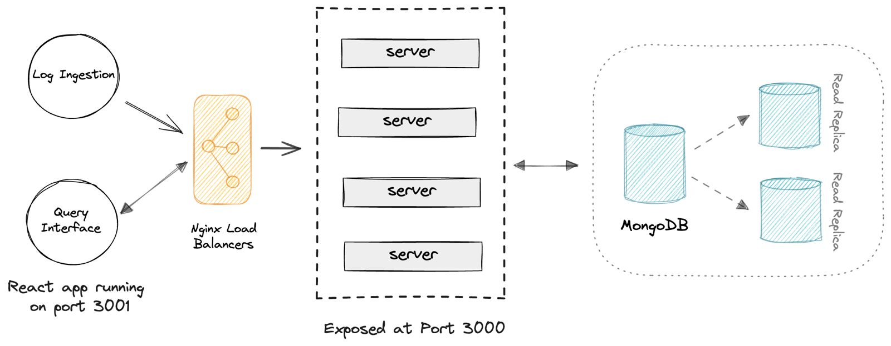

# Log Ingestor and Querying Interface

## Installation

1. Clone the repo
2. Change directory to backend
```
cd backend/
```
3. Install npm packages
```
npm install
```
4. Make a new file config.env
5. Copy config.env.test to a new file config.env
6. Run the server
```
node index.js
```
6. Open a new terminal and 
```
cd frontend/
```
8. Install npm packages
```
npm install
```
9. Run the react app
```
npm start
```

## Usage

Send log data to the log ingestor by making POST requests to http://localhost:3000/.
Use the querying interface to interactively search and filter log data.
Explore full-text search and advanced filtering options provided by MongoDB Atlas Search.

## System design

#### Overview

This repository contains a log ingestor and querying interface system designed to efficiently ingest logs, store them in MongoDB, and provide a powerful querying interface using ReactJS. The system is built on Node.js, with the ingestor listening on port 3000 to handle incoming log data via POST requests. MongoDB is utilized as the database, and Atlas Search with the Apache Lucene search engine is employed for full-text search and advanced filtering capabilities.



## Components

1. **Log Ingestor**:
The log ingestor is a Node.js application responsible for receiving log data via HTTP POST requests on port 3000. It processes incoming logs and stores them in MongoDB for further retrieval and analysis.

2. **MongoDB Database**:
MongoDB is used as the primary database for storing log data. It provides a scalable and efficient solution for data storage.

   * MongoDB Setup
Ensure you have MongoDB installed and running. Configure MongoDB connection details in the log ingestor's config.js file.

   * MongoDB Atlas Search
MongoDB Atlas Search embeds a fully managed Apache lucene index right alongside the database.
It is utilized to enhance querying capabilities, offering full-text search and advanced filtering using the Apache Lucene search engine.

3. **Querying Interface**:
The querying interface is a ReactJS application that communicates with the MongoDB database to fetch and display log data based on user queries. It leverages the power of Atlas Search to provide a seamless and responsive search experience.

## Why mongodb?
* No-sql database
* Flexible
* Supports replication to increase high availabilty
* Robust and highly scalable through sharding
* Both hortizontal and vertical scaling possible
* Supports atlas search for full text-search in real time
* Data is already in json(document) format
* No requirements to establish relation among different logs, hence, no sql database


## Why use mongodb atlas search?

#### Supports a variety of features some on them:
* Catalog and content search
* In-application search
* Single view
* Autocomplete
* Highlighting
* Fuzzy search
* Synonyms
* Custom scoring
* Semantic search
* Search nodes
* Query Analytics
* Local development


## List of features implemented

Querying inteface features:
* Offer a Web UI(on reactjs) for full-text search across logs.
* Implement fuzzy search across logs.
* Include advanced filters based on:
    - level
    - message
    - resourceId
    - timestamp
    - traceId
    - spanId
    - commit
    - metadata.parentResourceId

    These advanced filters support both full text-search and fuzzy search as well. 
* Role-based access to the query interface.
* Provides paginated data.
* Search within specific date ranges.
* Allows combining multiple filters.

Log Ingestor:
* Provides real-time log ingestion and searching capabilities.
* Replicated data base (primary + secondary + secondary) to introduce redundancy and high availabilty. Any secondary database can win in an election to become the primary database.
* Database inverse indexing(using Atlas Search(Apache Lucene engine)) scalability and speed.


## Benefits over ELK stack

* **Elasticsearch: A Bolt On approach:**
Integrating Elasticsearch for advanced search alongside a database enhances user experience but introduces complexities, including data synchronization and increased operational costs. This bolt-on approach may impede developer velocity and lead to technology sprawl.
    **-Lower developer productivity
    -Pay the sync tax
    -Operational overhead**
* **Sychroniztion overhead:**
Syncing data between the database and search engine through a custom pipeline, such as Apache Kafka, involves ongoing costs, hardware expansion, and monitoring. Simultaneous updates to both schemas for new features add dependencies, slowing down production changes. Eliminate synchronization overhead
Data is automatically and dynamically synced from the Atlas database to Atlas Search indexes. Developers and DevOps avoid having to stand up and manage their own sync mechanism, write custom transformation logic, or remap search indexes as the database schema evolves.

* **Remove operational heavy-lifting:**
MongoDB Atlas automates provisioning, replication, patching, upgrades, scaling, security, and disaster recovery while providing deep visibility into performance for both database and search. By working with a single platform, developers avoid the exponential increase in the number of system components you need to design, test, secure, monitor, and maintain.

* **Ship new features faster:**
By working with a unified API for both database and search operations, developers streamline queries, reduce development time, and eliminate the need to switch between query languages. This consolidation of driver packages enhances testing, enabling developers to reclaim engineering cycles lost to manual sync failure recovery and focus on innovation for end users.


## When to use MongoDB+ELK stack
Atlas Search is optimized for application search, tightly integrated with MongoDB Atlas. To use it, data must be stored in MongoDB collections for search indexes. However, for log analytics, observability Elasticsearch with its built-in connectors is often more suitable. In such cases, MongoDB can be used alongside Elasticsearch as one of your data sources.
